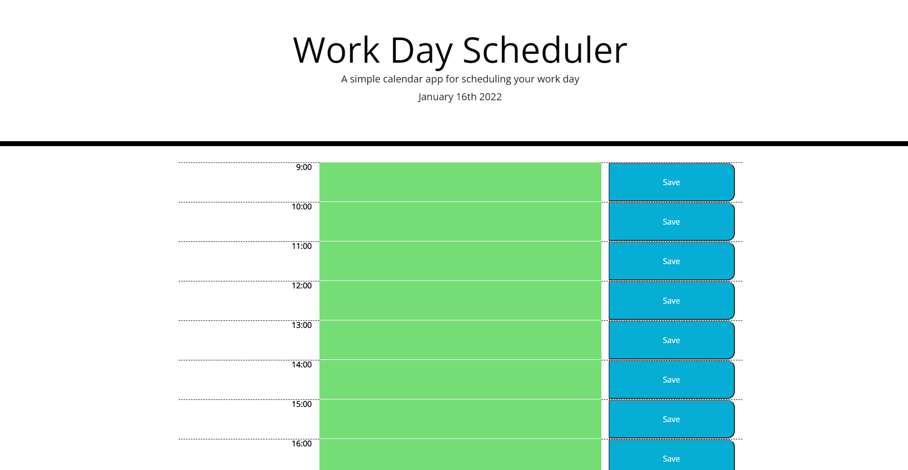
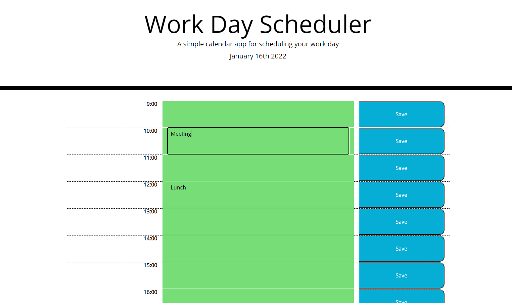

# Work Day Scheduler

## Purpose

Provides user with a simple daily planner based around work hours.

## Details

The current day is displayed at the top of the page. Timeslots are given from 09:00-17:00.  They are colour-coded so time past is grey, present is red and future is green. User can click each slot and type in to schedule events. On clicking save, their input is displayed in the slot and remains even if the page is refreshed.

## Screenshots

## Link

## Acknowledgements